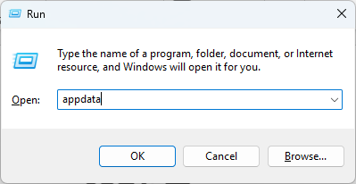
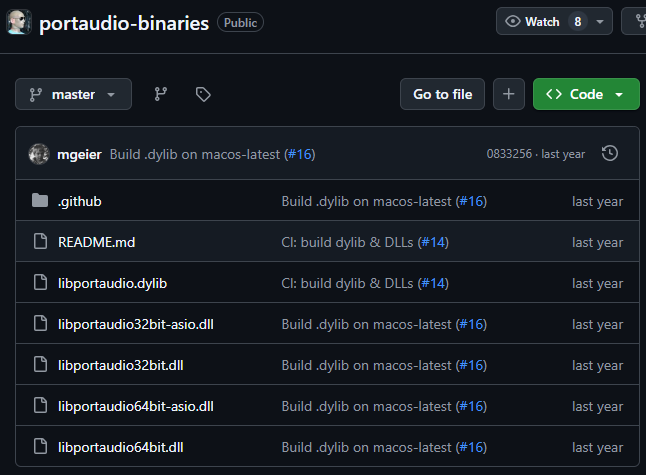
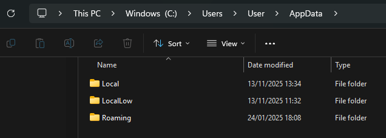
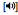
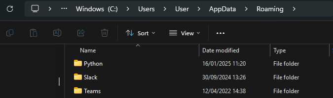
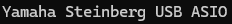

.. _installation:

Installation
============

Windows
-------

This chapter describes the installation process we recommend in detail. Following these instructions should make you ready and set to jump right into recording your data.

Moove requires:

- Python versions 3.9 to 3.12,

- numpy version < 2.0 and

- torch version < 2.6.

Before installation you should check your running python version in the Windows PowerShell with:

python --version

Moove can be easily installed using the Windows PowerShell and pip by entering the following line in a newly opened Windows PowerShell window.

   pip install moove

or for a specific version:

pip install moove==1.0.0

Moove will be installed on the same disk and folder path your python is installed on.

If you don’t know where your python is installed, follow these instructions.

Usually, your python is installed in **AppData > Roaming** or **AppData > Local**. You can access your AppData folder by typing *%appdata%* into Windows search or by pressing *Windows+R* and typing *appdata* in the opened window (Fig 1).

   Figure 1: Finding appdata folder

Within your AppData folder, you can now search for your Python installation in the folders **Local** or **Roaming** (Fig. 2).

|A screenshot of a computer AI-generated content may be incorrect.|\ |image3|

Figure 2: Find your python folder

Once you found your python folder, go into **Python > Python312** (or whatever version you have installed) **>** **site_packages**. This is where your **moove** folder is located, containing the codes for the **moovegui**, **moovetaf** and all additional utility codes. Furthermore, the folder **example_data** includes an example file from a previously recorded bird, that will be the first file opening in the MooveGUI (Fig. 3). You usually don’t need to access these folders at all, unless you want to confirm that everything is installed correctly or perhaps modify the code.

.. figure:: _static/images/image6.png
   :alt: A screenshot of a computer AI-generated content may be incorrect.
   :width: 6.26806in
   :height: 3.23472in

   Figure 3: Moove folder containing python code files

In **Python > Python312 > Scripts** you can find the **moovegui.exe** and **moovetaf.exe** (Fig. 4). This is the folder from where your program will start. You can also start the application from this folder directly, but using Windows PowerShell is easier.

.. figure:: _static/images/image7.png
   :alt: A screenshot of a computer AI-generated content may be incorrect.
   :width: 6.26806in
   :height: 1.49167in

   Figure 4: Moove applications

Portaudio
~~~~~~~~~

Moove uses the **sounddevice** (Geier et al., 2020) library, which depends on **PortAudio** (Bencina & Burk, 2001). On most systems, PortAudio is already available or bundled. If needed, e.g. if starting the program gives you an error saying sounddevice or portaudio missing, install **sounddevice** **using pip** in the Windows PowerShell.

pip install sounddevice

Enabling ASIO support
~~~~~~~~~~~~~~~~~~~~~

As Moove’s real-time targeting capabilities highly depend on low latency, we recommend using the **ASIO audio driver**. In Windows, ASIO support must be enabled separately in sounddevice. To do so, follow the instructions below.

1.1.2.1 Portaudio includes ASIO file
^^^^^^^^^^^^^^^^^^^^^^^^^^^^^^^^^^^^

The newest version of the sounddevice package already contains a file enabling ASIO support on windows. However, this needs to be made available for Moove first.

To do so, locate the folder where your sounddevice was installed. For this, again move into your **AppData** folder and into python **site-packages** (see above). Common paths for the sounddevice installation are

   C:\\Users\\<YourUsername>\\AppData\\Roaming\\Python\\<YourPythonVersion>\\site-packages\\\\\ **\_sounddevice_data\\portaudio-binaries**\\

or

   C:\\Users\\<YourUsername>\\AppData\\Local\\Programs\\Python\\<YourPythonVersion>\\Lib\\site-packages\\\ **\_sounddevice_data\\portaudio-binaries**\\

In this folder, you should find two .dll files, one named *libportaudio64bit.dll* and one named *libportaudio64bit-ASIO.dll*. If your folder does **not** contain the ASIO file, follow the instructions in 1.1.2.2.

.. figure:: _static/images/image8.png
   :alt: Ein Bild, das Text, Screenshot, Software, Multimedia-Software enthält. KI-generierte Inhalte können fehlerhaft sein.
   :width: 6.26806in
   :height: 1.92014in

   Figure 7: Replacing the portaudio file

If you really want to be sure you’re in the correct folder/ file, start moovetaf.exe and try to delete the .dll file: it will tell you you can’t because it is open in python – that’s when you know you’re correct.

Now, delete the *libportaudio64bit.dll* and **delete the -asio** ending from the second file in the folder. Once the **driver is installed, the PC restarted and the file replaced**, you should now be able to find the correct inputs/ outputs including **ASIO** in their name in the device list opened when starting MooveTaf. In our recording setup, this is the Yamaha Steinberg inputs/ outputs (see *Recommended Hardware*).

|image4|

1.1.2.2 Portaudio doesn’t include ASIO file
^^^^^^^^^^^^^^^^^^^^^^^^^^^^^^^^^^^^^^^^^^^

Download a new portaudio file with ASIO drivers enabled for Windows, e.g. from Github (Geier et al.).

https://github.com/spatialaudio/portaudio-binaries

Depending on your Windows, download the 32- or 64-bit version. If you are unsure, check in your system, but usually the highlighted file is the correct version (Fig. 6). Once installed, again follow the steps in 1.1.2.1 to head to your sounddevice folder, and replace the existing *libportaudio64bit.dll* file with the new downloaded one, renaming it from *libportaudio64bit-ASIO.dll* to *libportaudio64bit.dll*.

   Figure 6: Downloading the ASIO enabled portaudio file

MacOS
-----

Use homebrew to install portaudio before installing Moove.

brew install portaudio

Note: I think your python has to be installed via homebrew as well

Linux
-----

For Linux/ Ubuntu systems we recommend installing Moove in an environment.

In the terminal, first create a new python environment:

python -m venv venv

source venv/bin/activate

Then install all required packages:

sudo apt install python-dev-is-python3 gcc

sudo apt update && sudo apt install portaudio19-dev

sudo apt-get install python3-tk

Then install moove in the environment:

pip install moove

(Optional) Recommended hardware
-------------------------------

In our lab, we use the **Yamaha Steinberg IXO12/IXO22 audio interface** for recordings. If you are using a different setup, you can **ignore** the following pages explaining the setup with this specific interface.

This manual is mostly taken and modified from the Steinberg Website, so if you need more information check that out.

*https://www.steinberg.net/audio-interfaces/ixo12/*

Yamaha Steinberg IXO12 / 22 manual
~~~~~~~~~~~~~~~~~~~~~~~~~~~~~~~~~~

**IXO 12**: single microphone input

**IXO 22**: double microphone input

|Ein Bild, das Elektronik, Schaltung, Sound, Musik enthält. KI-generierte Inhalte können fehlerhaft sein.|

1. Input 1 gain adjustment

2. Mute input 1 (red light means muted)

3. Input 1 for microphone

4. Input 1 signal/ peak display

..

   Input gain should be adjusted such that with normal sound level it lights up green, and with peak sound level it should be blinking red shortly

i.   Red: -3 dBFS (decibel relative to full scale; 0 is max, higher leads to überwachungclipping) or higher

ii.  Green: -20 dBFP to less than -3 dBFS

iii. No light: less than -20 dBFP

5. Mute input 2 (second mic for IXO22; instrument input at IXO12)

6. Input 2 for microphone (only IXO22)

7. Input 2 signal/ peak display

8. +48V switch (phantom power):

   a. Turn on if you use a condenser microphone (without external power; e.g. RODE)

   b. DON’T turn on if you use a dynamic microphone that already has a power supply (e.g. small microphones with power supply box)

9. Additional adapter for jack plug (e.g. digital instrument)

   a. Info: if you connect a digital instrument to IXO22 the second microphone input is deleted

11. Monitor switch, switches between loopback and direct monitoring

    a. Loopback function display (mixes input signals with software generated audio signals from the computer, sends them back to computer) (10)

    b. Direct monitoring display (12)

       i.  Mono motoring |image5|: input 1 and 2 are emitted at LINE OUT or PHONES |image6| port

       ii. Stereo monitoring |image7|: displayed if input 1 is L and input 2 is R (both inputs for one signal; to treat them as single inputs use mono)

The loopback and monitoring functions should always be turned off, as it could lead to either sound playback (e.g. the bird song getting played back instantly) or the output channel being displayed on the input channel.

13. Input 2 gain adjustment (mic 2 or instrument for IXO22, instrument for IXO12)

14. Output level adjustment for LINE OUT L/R (for IXO12 also adjusts PHONES |image8|)

15. Power display (blinks permanent if power supply is insufficient)

16. PHONES |image9| adjustment for headphones (only IXO22)

17. PHONES |image10| plug for stereo headphones

|Ein Bild, das Screenshot, Elektronik, Schaltung, Verstärker enthält. KI-generierte Inhalte können fehlerhaft sein.|

1. LINE OUT L/R connection for external speakers (jack plug)

   a. For level adjustment use OUTPUT |image11| at the front

2. USB 2.0 port to connect to computer

3. 5V DC IN port to connect to an external power source

..

   Only necessary if you connect to a device that cannot supply sufficient power (e.g. iPad)

   Needs 5V DC with >=500mA

Yamaha Steinberg USB Driver
~~~~~~~~~~~~~~~~~~~~~~~~~~~

To use the audio device with MooveTaf, download the respective driver from the Steinberg website. This is only available for MacOS and Windows.

https://o.steinberg.net/de/support/downloads_hardware/yamaha_steinberg_usb_driver.html

Then restart your computer to enable the driver.

Setting options in the driver
~~~~~~~~~~~~~~~~~~~~~~~~~~~~~

|Ein Bild, das Text, Software, Zahl, Screenshot enthält. KI-generierte Inhalte können fehlerhaft sein.|

1. Can set the sample rate for your recordings (44.1 – 192 kHz)

|Ein Bild, das Text, Zahl, Schrift, Reihe enthält. KI-generierte Inhalte können fehlerhaft sein.|

1. Choose your device (only necessary if more than one connected)

2. Choose latency mode

   a. Low latency (needs high computing power on your device)

   b. Standard latency

   c. Stable latency (high latency, focused on a stable signal rather than a quick one; for devices with lower computing power)

3. Buffer size

   a. varies depending on your sampling frequency

   b. latency depends on buffer size

..

   lower buffer size = lower audio latency

4. Input/ Output latency of the signal

   a. latency depends on buffer size

..

   lower buffer size = lower audio latency

.. |Ein Bild, das Elektronik, Schaltung, Sound, Musik enthält. KI-generierte Inhalte können fehlerhaft sein.| image:: _static/images/image11.png
   :width: 5.38617in
   :height: 4.46937in
.. |Ein Bild, das Screenshot, Elektronik, Schaltung, Verstärker enthält. KI-generierte Inhalte können fehlerhaft sein.| image:: _static/images/image15.png
   :width: 5.62579in
   :height: 1.96902in
.. |Ein Bild, das Text, Software, Zahl, Screenshot enthält. KI-generierte Inhalte können fehlerhaft sein.| image:: _static/images/image17.png
   :width: 3.07587in
   :height: 1.88669in
.. |Ein Bild, das Text, Zahl, Schrift, Reihe enthält. KI-generierte Inhalte können fehlerhaft sein.| image:: _static/images/image18.png
   :width: 3.0627in
   :height: 1.86722in
.. |image10| image:: _static/images/image13.png
   :width: 0.15627in
   :height: 0.14585in

.. |image5| image:: _static/images/image12.png
   :width: 0.17711in
   :height: 0.16669in
.. |image6| image:: _static/images/image13.png
   :width: 0.15627in
   :height: 0.14585in
.. |image7| image:: _static/images/image14.png
   :width: 0.18753in
   :height: 0.14585in
.. |image8| image:: _static/images/image13.png
   :width: 0.15627in
   :height: 0.14585in
.. |image9| image:: _static/images/image13.png
   :width: 0.15627in
   :height: 0.14585in
