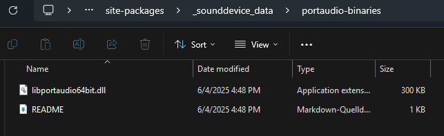
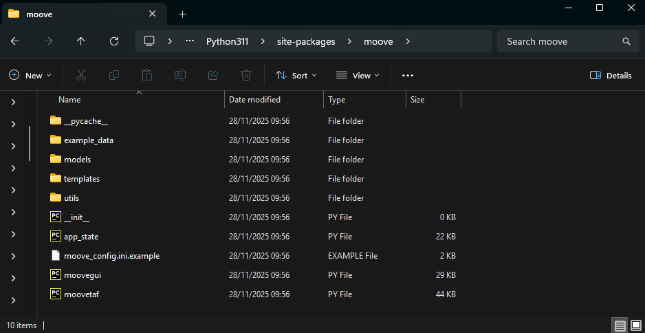
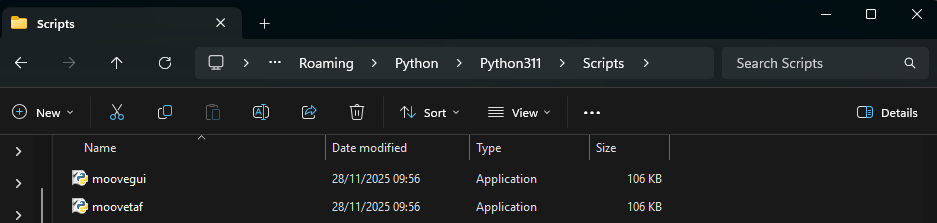
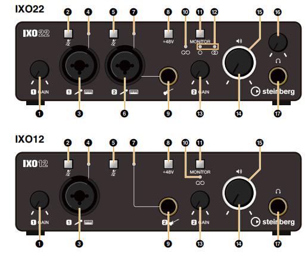
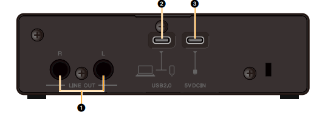
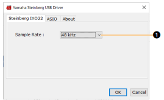
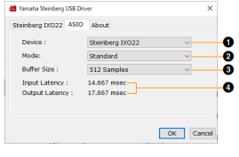
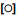
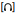

.. _installation:

Installation
============

Quick start
-----------

The fastest way to get Moove running (requires Python 3.9 -- 3.12 and
`uv <https://docs.astral.sh/uv/>`_):

.. code-block:: bash

   git clone https://github.com/veitlab/moove.git
   cd moove
   uv sync
   uv run moovegui        # GUI for datasets & training
   uv run moovetaf        # real-time recording & targeting

If you do not have ``uv`` yet:

.. code-block:: bash

   # macOS / Linux
   curl -LsSf https://astral.sh/uv/install.sh | sh

   # Windows (PowerShell)
   powershell -ExecutionPolicy ByPass -c "irm https://astral.sh/uv/install.ps1 | iex"

Requirements
------------

- **Python 3.9 -- 3.12** (3.11 recommended)
- **PortAudio** -- required by ``sounddevice`` for audio I/O (see
  :ref:`platform-notes` below)
- A working audio input/output device for real-time experiments

.. _install-pip:

Installing with pip
-------------------

Moove can also be installed from PyPI:

.. code-block:: bash

   pip install moove

or for a specific version:

.. code-block:: bash

   pip install moove==1.0.3

After installation the entry points ``moovegui`` and ``moovetaf`` are
available on your ``PATH``.  A default configuration file
(``moove_config.ini``) will be created at ``~/.moove/`` on first start.

Installing from source with uv (recommended for development)
------------------------------------------------------------

.. code-block:: bash

   git clone https://github.com/veitlab/moove.git
   cd moove
   uv sync          # creates .venv and installs all deps
   uv run moovegui  # run the GUI

``uv sync`` resolves all dependencies (including PyQt6, PyTorch, etc.)
into an isolated virtual environment.  This is the recommended method for
development because it is fully reproducible via the checked-in
``uv.lock`` file.

.. _platform-notes:

Platform-specific notes
-----------------------

Windows
~~~~~~~

PortAudio is bundled with the ``sounddevice`` pip package on Windows, so
no extra system-level installation is needed.

.. code-block:: powershell

   pip install moove
   moovegui

If you need **low-latency ASIO support**, see :ref:`asio-setup` below.

macOS
~~~~~

PortAudio must be installed via Homebrew **before** installing Moove:

.. code-block:: bash

   brew install portaudio
   pip install moove
   moovegui

If you use ``uv`` you only need PortAudio on the system; ``uv sync``
handles everything else.

Linux (Debian / Ubuntu)
~~~~~~~~~~~~~~~~~~~~~~~

Install the PortAudio development library and system dependencies:

.. code-block:: bash

   sudo apt update
   sudo apt install python3-dev gcc portaudio19-dev

Then install Moove in a virtual environment:

.. code-block:: bash

   python3 -m venv .venv
   source .venv/bin/activate
   pip install moove
   moovegui

Or with ``uv``:

.. code-block:: bash

   uv sync
   uv run moovegui

.. note::

   Previous versions of Moove required ``python3-tk`` (Tkinter).  Since
   Moove now uses PyQt6 for its GUI this dependency is no longer needed.

.. _asio-setup:

Enabling ASIO support (Windows)
-------------------------------

Moove's real-time targeting depends on low audio latency.  On Windows
the **ASIO** audio driver provides the lowest latency and is strongly
recommended for real-time experiments.

Modern method (sounddevice ≥ 0.5)
~~~~~~~~~~~~~~~~~~~~~~~~~~~~~~~~~

Recent versions of ``sounddevice`` ship **two** PortAudio DLLs -- one
with and one without ASIO support.  You can activate ASIO by setting an
environment variable **before** starting Moove:

.. code-block:: powershell

   # PowerShell -- temporary (current session only)
   $env:SD_ENABLE_ASIO = "1"
   moovegui

   # or permanently via System Environment Variables

This is the easiest method and does not require manual file replacement.

Legacy method (manual DLL replacement)
~~~~~~~~~~~~~~~~~~~~~~~~~~~~~~~~~~~~~~~

If your ``sounddevice`` version does not include the ASIO DLL, you can
replace the PortAudio binary manually:

1. Locate the PortAudio DLL in your ``sounddevice`` installation.
   Common paths:

   .. code-block:: text

      C:\Users\<User>\AppData\Roaming\Python\<Version>\site-packages\_sounddevice_data\portaudio-binaries\
      C:\Users\<User>\AppData\Local\Programs\Python\<Version>\Lib\site-packages\_sounddevice_data\portaudio-binaries\

2. You should see ``libportaudio64bit.dll`` and possibly
   ``libportaudio64bit-ASIO.dll``.

3. If both files exist: delete ``libportaudio64bit.dll`` and rename
   ``libportaudio64bit-ASIO.dll`` to ``libportaudio64bit.dll``.

4. If only the non-ASIO DLL exists: download the ASIO-enabled binary
   from https://github.com/spatialaudio/portaudio-binaries and replace
   the existing file.

5. **Install the Steinberg ASIO driver** for your audio interface,
   restart your PC, and verify that ASIO devices appear when starting
   MooveTaf.

   Figure: The portaudio-binaries folder with both DLL variants.

Custom PortAudio path
~~~~~~~~~~~~~~~~~~~~~

You can also point ``sounddevice`` to a custom PortAudio build via the
``SD_PORTAUDIO`` environment variable:

.. code-block:: powershell

   $env:SD_PORTAUDIO = "C:\path\to\my\libportaudio64bit.dll"
   moovegui

This is useful if you compile PortAudio with ASIO support yourself.

Installing with conda
---------------------

.. note::

   The conda-forge package is prepared but **not yet uploaded**.
   The instructions below will work once the feedstock has been accepted.

Moove can be installed from conda-forge:

.. code-block:: bash

   conda install -c conda-forge moove

or, if you use `mamba <https://mamba.readthedocs.io/>`_ (recommended for
faster dependency resolution):

.. code-block:: bash

   mamba install -c conda-forge moove

This will automatically pull in all required dependencies including
PortAudio, PyTorch, matplotlib, and the helper packages (evfuncs,
rangeslider, etc.).

After installation the entry points ``moovegui`` and ``moovetaf`` are
available on your ``PATH``:

.. code-block:: bash

   moovegui        # GUI for datasets & training
   moovetaf        # real-time recording & targeting

.. note::

   The conda-forge PortAudio package does **not** include ASIO support
   due to the proprietary Steinberg ASIO SDK license.  For Windows
   real-time experiments that require ASIO, use the pip installation
   instead (``pip install sounddevice`` bundles ASIO-enabled binaries).

Where is Moove installed?
-------------------------

After ``pip install moove``, the package lives in your Python
``site-packages`` directory.  On Windows a typical path is:

   ``C:\Users\<User>\AppData\Local\Programs\Python\Python312\Lib\site-packages\moove\``

The entry-point scripts (``moovegui.exe``, ``moovetaf.exe``) are in the
corresponding ``Scripts`` folder:

   ``C:\Users\<User>\AppData\Local\Programs\Python\Python312\Scripts\``

You usually do not need to access these folders directly.

   Figure: Moove folder in site-packages.

   Figure: Moove entry points in the Scripts folder.

(Optional) Recommended hardware
-------------------------------

In our lab, we use the **Yamaha Steinberg IXO12 / IXO22 audio
interface** for recordings.  If you are using a different setup, you can
skip the following pages.

This manual section is mostly adapted from the Steinberg website:
https://www.steinberg.net/audio-interfaces/ixo12/

Yamaha Steinberg IXO12 / 22 manual
~~~~~~~~~~~~~~~~~~~~~~~~~~~~~~~~~~~

**IXO 12**: single microphone input

**IXO 22**: double microphone input

1. Input 1 gain adjustment
2. Mute input 1 (red light = muted)
3. Input 1 for microphone
4. Input 1 signal / peak display

   - Red: −3 dBFS or higher
   - Green: −20 dBFS to < −3 dBFS
   - No light: < −20 dBFS

   Adjust input gain so normal sound levels light up green, and peak
   levels blink red briefly.

5. Mute input 2 (second mic for IXO22; instrument input on IXO12)
6. Input 2 for microphone (IXO22 only)
7. Input 2 signal / peak display
8. +48 V phantom power switch

   - Turn **on** for condenser microphones without external power (e.g. RODE)
   - **Do not** turn on for dynamic microphones with a separate power supply

9. Jack plug adapter (e.g. digital instrument)

   Connecting a digital instrument to IXO22 disables the second
   microphone input.

10. Loopback function display
11. Monitor switch (loopback / direct monitoring)
12. Direct monitoring display

    - Mono |image5|: inputs 1+2 routed to LINE OUT / PHONES |image6|
    - Stereo |image7|: input 1 = L, input 2 = R

    Loopback and monitoring should always be **off** to avoid playback
    feedback or mixing input with output.

13. Input 2 gain adjustment
14. Output level adjustment for LINE OUT L/R
15. Power display (blinks if power supply is insufficient)
16. PHONES |image9| adjustment (IXO22 only)
17. PHONES |image10| plug for stereo headphones

1. LINE OUT L/R connection for external speakers (jack plug)
2. USB 2.0 port to connect to computer
3. 5 V DC IN port for external power (only needed if your host device
   cannot supply sufficient power, e.g. iPad; requires 5 V DC ≥ 500 mA)

Yamaha Steinberg USB Driver
~~~~~~~~~~~~~~~~~~~~~~~~~~~

Download the driver from the Steinberg website (available for macOS and
Windows):

https://o.steinberg.net/de/support/downloads_hardware/yamaha_steinberg_usb_driver.html

Restart your computer after installation.

Setting options in the driver
~~~~~~~~~~~~~~~~~~~~~~~~~~~~~

1. Sample rate (44.1 -- 192 kHz)

1. Device selection (if more than one connected)
2. Latency mode

   - Low latency (requires high CPU performance)
   - Standard latency
   - Stable latency (highest latency; for devices with lower CPU performance)

3. Buffer size (depends on sampling frequency)
4. Input / Output latency (depends on buffer size; lower = faster)

